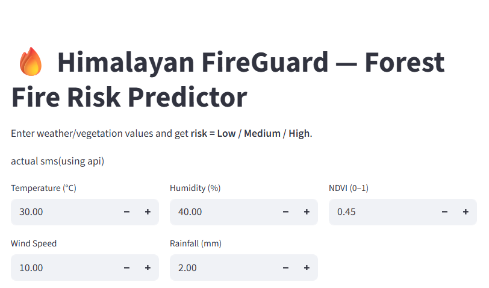

#  Fire Risk Prediction System

##  Overview
The Fire Risk Prediction System is a machine learning-based web application that predicts the likelihood of fire occurrence based on environmental conditions such as temperature, humidity, and wind.

This project demonstrates the practical implementation of machine learning in real-world risk assessment using an interactive web interface built with Streamlit.

##  Features
- Predict fire risk based on user input  
- Interactive and simple UI using Streamlit  
- Real-time prediction using trained ML model  
- Lightweight and easy to run locally  

## Tech Stack
- Programming Language: Python  
- Libraries: Pandas, NumPy, Scikit-learn  
- Web Framework: Streamlit  

## Project Structure
fire-risk-prediction/
│
├── app.py
├── model.pkl
├── data.csv
├── requirements.txt
└── README.md

---

## ⚙️ Installation & Setup

1. Clone the repository
git clone https://github.com/your-username/fire-risk-prediction.git
cd fire-risk-prediction

2. Install dependencies
pip install -r requirements.txt

3. Run the application
streamlit run app.py

## Model Information
- Problem Type: Classification
- Input Features: Temperature, Humidity, Wind, etc.
- Output: Fire Risk (Low / High)
- Accuracy: 88%

## Screenshots

### User Interface

### Prediction Output

## Future Enhancements
- Improve model performance with advanced algorithms  
- Deploy the application on cloud (Streamlit Cloud)  
- Add more environmental parameters  
- Enhance UI/UX for better user experience  

## Author
Chandan Bisht  

---

## Acknowledgement
This project is created as part of learning and applying machine learning concepts to real-world scenarios.
